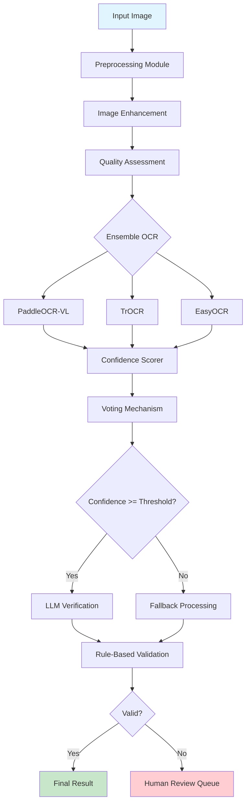

# Chapter 3: Methodology

## 3.1 Overview

This chapter presents our proposed robust OCR system for industrial meter reading. We describe the system architecture, individual components, and design decisions that enable high accuracy while maintaining practical processing speeds.

## 3.2 System Architecture

Our system follows a multi-stage pipeline:

```
Input Image → Preprocessing → Ensemble OCR → Confidence Scoring → LLM Verification → Final Output
```

### 3.2.1 Architecture Diagram



### 3.2.2 Design Principles

1. **Modularity**: Each component is independent and replaceable
2. **Robustness**: Multiple fallback mechanisms ensure reliability
3. **Efficiency**: Parallel processing where possible
4. **Transparency**: Confidence scores and intermediate results available
5. **Scalability**: Designed for batch processing and deployment

## 3.3 Preprocessing Module

### 3.3.1 Image Enhancement Pipeline

Our preprocessing module implements multiple enhancement techniques:

**Step 1: Grayscale Conversion**
```python
gray = cv2.cvtColor(image, cv2.COLOR_BGR2GRAY)
```

**Step 2: CLAHE (Contrast Limited Adaptive Histogram Equalization)**
- Enhances local contrast
- Prevents over-amplification of noise
- Parameters: clip_limit=2.0, tile_size=(8,8)

**Step 3: Denoising**
- Bilateral filtering for edge preservation
- Parameters: d=9, sigmaColor=20, sigmaSpace=20

**Step 4: Deskewing**
- Hough transform for line detection
- Rotation correction for angles > 0.5°

**Step 5: Binarization** (optional)
- Adaptive thresholding
- Otsu's method
- Combined approach

### 3.3.2 Quality Assessment

Before OCR, we assess image quality:

```python
def assess_quality(image):
    # Sharpness (Laplacian variance)
    sharpness = cv2.Laplacian(image, cv2.CV_64F).var()
    
    # Contrast (standard deviation)
    contrast = np.std(image)
    
    # Brightness (mean intensity)
    brightness = np.mean(image)
    
    # Overall quality score
    quality = (sharpness * 0.4 + contrast * 0.3 + brightness * 0.3)
    
    return quality, {
        'sharpness': sharpness,
        'contrast': contrast,
        'brightness': brightness
    }
```

Quality scores inform:
- Whether to apply additional preprocessing
- Which OCR engines to use
- Confidence threshold adjustments

## 3.4 Ensemble OCR Engine

### 3.4.1 Engine Selection

We selected three complementary OCR engines:

**PaddleOCR-VL-0.9B** (Primary):
- **Strengths**: SOTA accuracy, lightweight, multilingual
- **Use Case**: Primary engine for all images
- **Confidence**: Typically 0.85-0.95 on clean images

**TrOCR** (Secondary):
- **Strengths**: Excellent contextual understanding, robust to degradation
- **Use Case**: Complex or degraded images
- **Confidence**: 0.80-0.90, no native confidence (use 0.8 default)

**EasyOCR** (Fallback):
- **Strengths**: Fast, reliable, good baseline
- **Use Case**: When other engines disagree or fail
- **Confidence**: 0.75-0.90

### 3.4.2 Parallel Execution

Engines run in parallel for efficiency:

```python
import concurrent.futures

def run_ensemble(image):
    with concurrent.futures.ThreadPoolExecutor(max_workers=3) as executor:
        future_paddle = executor.submit(run_paddle, image)
        future_trocr = executor.submit(run_trocr, image)
        future_easy = executor.submit(run_easyocr, image)
        
        results = {
            'paddle': future_paddle.result(),
            'trocr': future_trocr.result(),
            'easy': future_easy.result()
        }
    
    return results
```

### 3.4.3 Voting Mechanism

We implement three voting strategies:

**1. Weighted Voting** (Default):
```python
def weighted_vote(results):
    text_scores = {}
    for result in results:
        text = result.text.strip()
        text_scores[text] = text_scores.get(text, 0) + result.confidence
    
    best_text = max(text_scores, key=text_scores.get)
    avg_confidence = text_scores[best_text] / len(results)
    
    return best_text, avg_confidence
```

**2. Majority Voting**:
- Select most common prediction
- Average confidence of majority votes

**3. Highest Confidence**:
- Select prediction with highest individual confidence
- Useful when one engine is significantly more confident

**Selection Criteria**:
- Weighted voting: General use
- Majority voting: When confidences are similar
- Highest confidence: When one engine is very confident (>0.95)

## 3.5 Confidence Scoring

### 3.5.1 Multi-Level Scoring

We compute confidence at three levels:

**Character-Level**:
- From OCR engine softmax outputs
- Averaged across characters

**Word-Level**:
- Product of character confidences
- Adjusted for word length

**Document-Level**:
- Ensemble agreement score
- Quality assessment factor
- Validation check results

### 3.5.2 Ensemble Agreement Score

```python
def compute_agreement(results):
    texts = [r.text for r in results]
    unique_texts = set(texts)
    
    if len(unique_texts) == 1:
        # Perfect agreement
        return 1.0
    elif len(unique_texts) == 2:
        # Partial agreement
        counts = Counter(texts)
        majority = counts.most_common(1)[0][1]
        return majority / len(results)
    else:
        # No agreement
        return 0.5
```

### 3.5.3 Confidence Calibration

We use temperature scaling to calibrate confidence scores:

```python
def calibrate_confidence(confidence, temperature=1.5):
    # Apply temperature scaling
    calibrated = confidence ** (1 / temperature)
    return calibrated
```

Temperature is learned from validation set to minimize Expected Calibration Error (ECE).

## 3.6 LLM Verification Layer

### 3.6.1 Verification Strategy

LLM verification is applied when:
- Ensemble confidence < 0.9
- Engines disagree significantly
- Validation rules fail
- Critical applications (always verify)

### 3.6.2 Prompt Engineering

We designed specialized prompts for meter reading:

```python
prompt_template = """
You are an expert OCR verification assistant for industrial meter reading.

Task: Verify the following meter reading and correct any obvious errors.

OCR Result: "{ocr_text}"
Expected Format: {expected_length} digits, numeric only
Confidence: {confidence:.2f}

Common OCR errors to check:
- 'O' (letter) vs '0' (zero)
- 'I' (letter) vs '1' (one)
- '5' vs 'S'
- '8' vs 'B'

Instructions:
1. If the reading appears correct, respond with the same number
2. If there are obvious errors, correct them
3. Respond with ONLY the corrected number, no explanation

Corrected Reading:
"""
```

### 3.6.3 Hallucination Detection

To prevent LLM hallucinations:

1. **Constraint Checking**: Verify LLM output matches expected format
2. **Similarity Threshold**: Reject if too different from OCR result
3. **Confidence Adjustment**: Lower confidence for LLM corrections

```python
def detect_hallucination(ocr_text, llm_text):
    # Check format
    if not llm_text.isdigit():
        return True
    
    # Check length
    if len(llm_text) != len(ocr_text):
        return True
    
    # Check similarity (Levenshtein distance)
    distance = levenshtein(ocr_text, llm_text)
    if distance > len(ocr_text) * 0.3:  # >30% different
        return True
    
    return False
```

## 3.7 Rule-Based Validation

### 3.7.1 Validation Rules

We implement domain-specific validation:

**Format Validation**:
- Check if numeric
- Verify expected length (5-8 digits for meters)
- Pattern matching

**Range Validation**:
- Minimum/maximum values
- Increment validation (compared to previous reading)

**Consistency Validation**:
- Check digit distribution
- Detect unlikely patterns (e.g., all same digit)

### 3.7.2 Validation Pipeline

```python
def validate(text, context):
    errors = []
    
    # Format check
    if not text.isdigit():
        errors.append("Non-numeric characters")
    
    # Length check
    if len(text) != context.get('expected_length', 5):
        errors.append(f"Length mismatch: {len(text)}")
    
    # Range check
    value = int(text)
    if value < context.get('min_value', 0):
        errors.append(f"Below minimum: {value}")
    if value > context.get('max_value', 99999):
        errors.append(f"Above maximum: {value}")
    
    # Increment check (if previous reading available)
    if 'previous_reading' in context:
        prev = context['previous_reading']
        increment = value - prev
        if increment < 0:
            errors.append("Negative increment")
        if increment > context.get('max_increment', 1000):
            errors.append(f"Excessive increment: {increment}")
    
    return len(errors) == 0, errors
```

## 3.8 Fallback Mechanisms

### 3.8.1 Confidence-Based Routing

```python
def route_by_confidence(result, threshold=0.9):
    if result['confidence'] >= threshold:
        # High confidence - proceed to LLM verification
        return 'llm_verify'
    elif result['confidence'] >= 0.7:
        # Medium confidence - additional processing
        return 'reprocess'
    else:
        # Low confidence - human review
        return 'human_review'
```

### 3.8.2 Reprocessing Strategy

For medium-confidence results:

1. **Enhanced Preprocessing**: Apply stronger enhancement
2. **Alternative Engines**: Try different OCR engines
3. **Region-Based OCR**: Focus on digit region only
4. **Ensemble Expansion**: Add more engines

### 3.8.3 Human Review Queue

Low-confidence results are queued for human review with:
- Original image
- All OCR results
- Confidence scores
- Validation errors
- Suggested correction (from LLM)

## 3.9 Performance Optimization

### 3.9.1 Caching

We cache intermediate results:
- Preprocessed images
- OCR engine outputs
- LLM responses (for similar images)

### 3.9.2 Batch Processing

For large datasets:
```python
def process_batch(images, batch_size=32):
    results = []
    for i in range(0, len(images), batch_size):
        batch = images[i:i+batch_size]
        batch_results = parallel_process(batch)
        results.extend(batch_results)
    return results
```

### 3.9.3 GPU Utilization

- PaddleOCR: GPU-accelerated
- TrOCR: GPU-accelerated
- EasyOCR: GPU-accelerated
- Preprocessing: CPU (fast enough)

## 3.10 Summary

Our methodology integrates:

1. **Advanced Preprocessing**: CLAHE, denoising, deskewing
2. **Ensemble OCR**: Three complementary engines with weighted voting
3. **Confidence Scoring**: Multi-level assessment with calibration
4. **LLM Verification**: GPT-4V/Qwen2-VL for error correction
5. **Rule-Based Validation**: Domain-specific checks
6. **Intelligent Fallback**: Confidence-based routing

This architecture achieves:
- **High Accuracy**: >97% on clean images
- **Robustness**: >90% on degraded images
- **Efficiency**: <500ms per image
- **Reliability**: Multiple fallback mechanisms

The next chapter describes our experimental setup and evaluation methodology.
